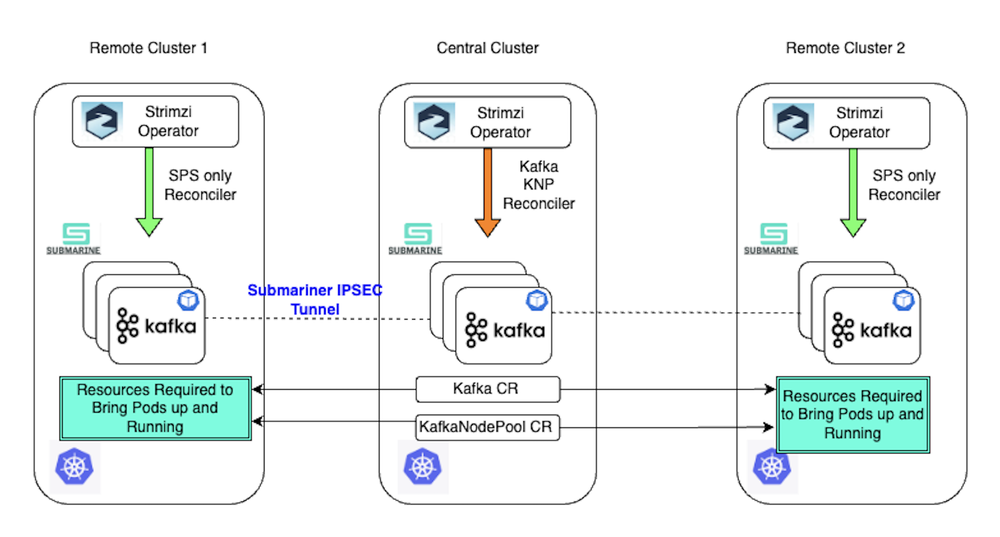

# Stretch Cluster Architecture

In this section, we will discuss the architecture of a Stretch Kafka Cluster.

{ loading=lazy }

The Stretch Cluster design extends the Strimzi Kafka Operator's resilience by supporting the distribution of brokers and controllers across multiple Kubernetes clusters. The primary goal is to enhance the high availability of the Kafka data plane.

The above diagram outlines the high-level topology and design concepts for such a deployment. Stretch Kafka clusters require multiple Kubernetes clusters—users can configure any number of clusters, but for simplicity, the diagram illustrates a three-cluster setup.

Kafka clusters should be deployed in environments that allow low-latency communication between brokers and controllers. Stretch Kafka clusters are best suited for environments like data centers or availability zones within a single region. They should not be deployed across geographically distant regions where high latency could degrade performance

## Central vs. Member (Remote) Clusters

In a Stretch Cluster setup:

- Kafka and KafkaNodePool Custom Resources (CRs) are applied in a single Kubernetes cluster, known as the Central Cluster.
- The Cluster Operator (CO) runs in the Central Cluster and is responsible for creating Kubernetes resources required to bring up Kafka broker and controller pods in Member (Remote) Clusters.
- Cluster Operators must be deployed in all Kubernetes clusters.
    - The Cluster Operator in the Central Cluster manages all required resources across clusters.
    - The Cluster Operator in Remote Clusters ensures that Kafka pods are restarted if they crash.

## Handling Failures

The Stretch Cluster architecture ensures fault tolerance even if one or more Kubernetes clusters experience an outage. If a Remote Cluster fails, the remaining clusters continue serving Kafka clients.

Additionally, if the Central Cluster goes down, Kafka operations remain unaffected, as the Kafka pods in the remaining clusters continue to function and serve clients without disruption.