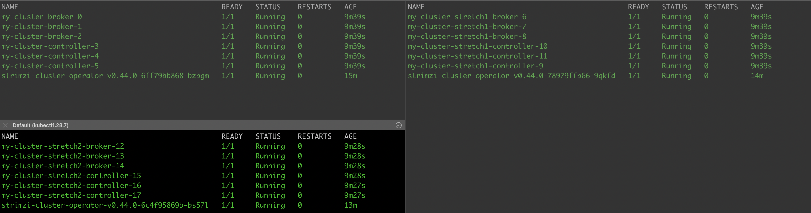
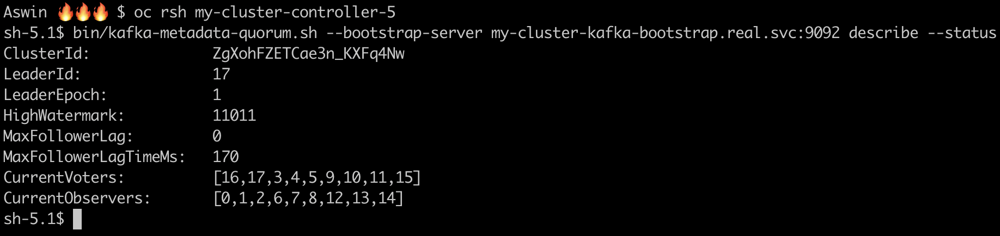
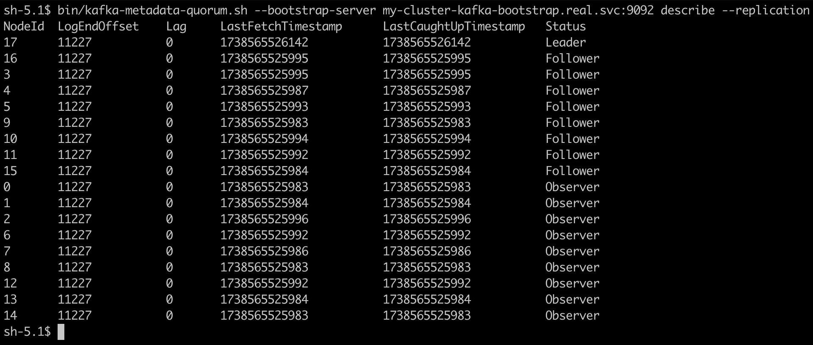
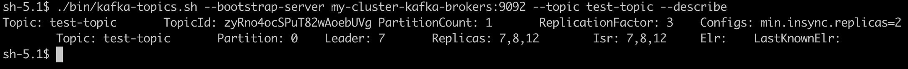
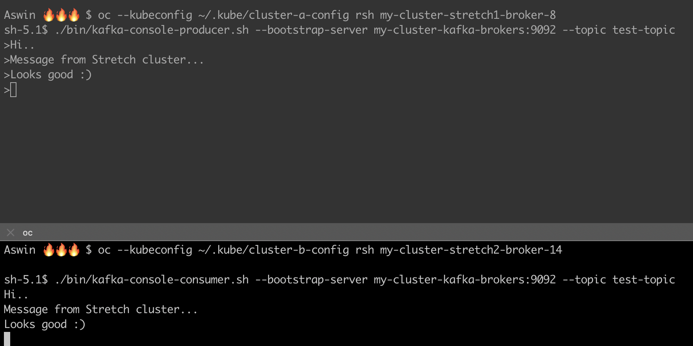

# Stretch Cluster Testing
This section provides an overview of the basic tests performed to validate the functionality of the stretch Kafka cluster using Submariner. The goal of these tests was to ensure basic connectivity, replication, and message flow across multiple Kubernetes clusters.

## Pod Deployment Across Clusters

### Purpose
To confirm that Kafka broker pods are successfully created in multiple clusters as per the stretch configuration.

### Test Execution

💠 Deployed Kafka, KafkaNodePool CR in central cluster. 
💠 Ensured pods were created in the expected clusters. 
💠 Verified pod logs for successful startup and connectivity.

### Results
🔸 Kafka broker and controller pods successfully deployed in different clusters.  
🔸 Pods registered correctly with KRaft controller. 
🔸 No connectivity issues detected between brokers after running.

{ loading=lazy }

## Metadata Quorum Validation

### Purpose
To verify that the Kafka Controller Quorum is correctly established across the clusters and that leader election functions properly.

### Test Execution
💠 Deployed Kafka in a stretch cluster setup.  
💠 Verified `controller.quorum.voters` configuration to ensure controllers are recognized across clusters. 
💠 Checked logs of controller nodes to confirm leader election and quorum establishment.

### Results

🔸 Kafka correctly recognized controllers in multiple clusters.  
🔸 Leader election succeeded, and controllers were able to reach consensus.  
🔸 No unexpected failures in metadata synchronization.

{ loading=lazy }

## Topic Replication Across Clusters

### Purpose

To ensure that topic replication functions correctly and that partitions are distributed across multiple clusters.

### Test Execution

💠 Created a topic with multiple partitions and replication factor >1.  
💠 Checked partition placement across brokers in different clusters. 
💠 Used kafka-topics.sh --describe to verify partition replication status.

### Results

🔸 Partitions were correctly placed across multiple clusters. 
🔸 Replication worked as expected, with followers keeping up with the leader. 
🔸 No significant replication lag observed.

{ loading=lazy }

{ loading=lazy }

## Producing and Consuming Messages

### Purpose
To validate end-to-end message flow across the stretch cluster.

### Test Execution

💠 Started a producer and sent messages to a replicated topic. 
💠 Started a consumer in a different cluster and checked for message delivery.

### Results:

🔸 Messages were successfully produced and consumed across clusters. 
🔸 No significant delays or dropped messages observed. 
🔸 Kafka clients could connect seamlessly across clusters.

{ loading=lazy }